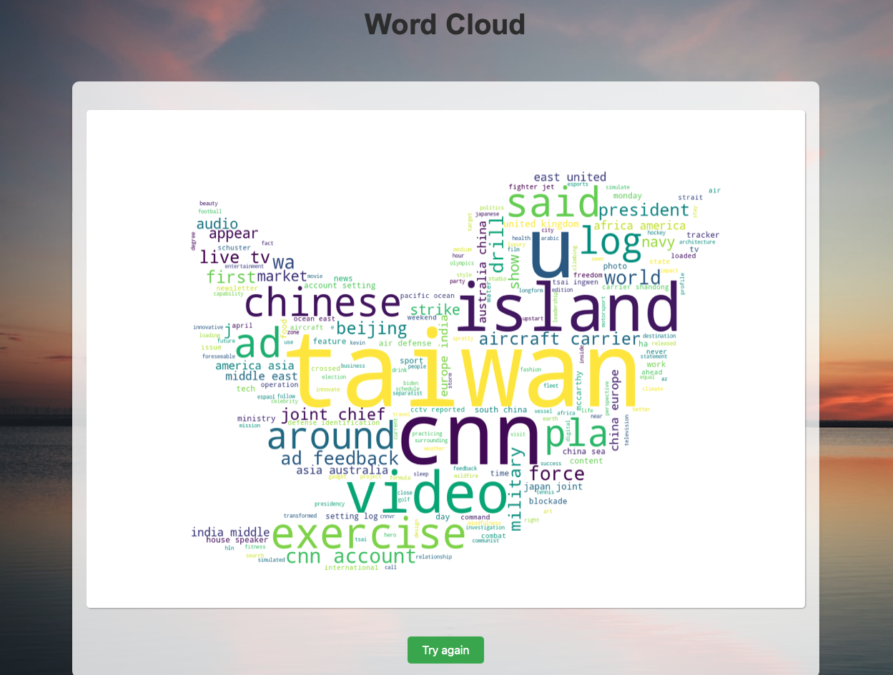

# Word Cloud Generator

- This Word Cloud Generator is a web application built using Flask, Python, and Beautiful Soup, allowing users to create word clouds based on the text from a given URL and a selected shape.
- As for the design for the web page, we make the backgroud of our web serves as dynamic wallpaper which can change every 10 seconds.
- To reach this, we access the image from Unsplash by its API.
- Notice!! You should use your own Unsplash API. You can apply on the Unsplash website by yourself.





## Features

- Fetch text content from a provided URL
- Generate a word cloud based on the fetched text
- Choose from four different shapes for the word cloud. 

  (***generate any shapes of word cloud*** whatever you want, as long as you should put the imag(shape).png you want to the static file.)
  
- Display the generated word cloud on the result page

## Installation

1. Clone the repository or download the source code:

```bash
git clone https://github.com/Chris1116/word-cloud-generator.git

```

2. Change the directory to the project folder:

```bash
cd word-cloud-generator
```

3. Create a virtual environment and activate it:

```bash
python3 -m venv venv
source venv/bin/activate
```

4. Install the required packages:

```bash
pip install -r requirements.txt
```

## Usage

1. Run the Flask app

```bash
export FLASK_APP=app.py
flask run 
```

2. Open a web browser and navigate to http://localhost:5000.

3. Enter a URL and select a shape for the word cloud, then click the "Submit" button.

4. View the generated word cloud on the result page.

## Technologies

- Flask
- Python
- Beautiful Soup
- WordCloud
- HTML/CSS/JavaScript

## Lincense

This project is licensed under the MIT License.

